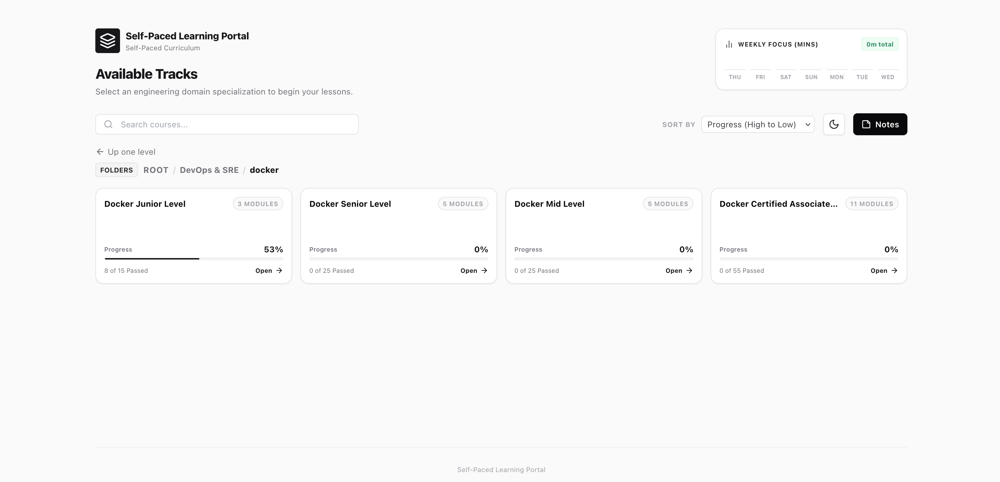
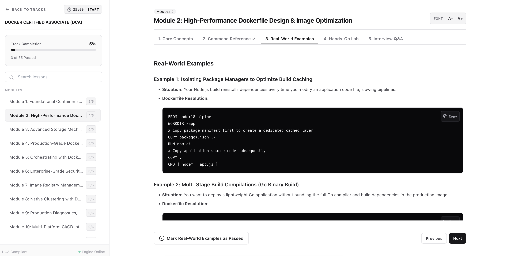

# Self-Paced Learning Portal

A lightweight, self-hosted learning portal for self-paced study in DevOps, SRE, and software development. 

## Courses
- Docker junior, mid, and senior levels
- Docker Certified Associate (DCA)
- Kubernetes Administrator (CKA) (In Progress)
- ...

## Visuals

### Course Selection Dashboard


### Interactive Workspace


## Features

* **Zero-Config Isolation:** Automatically bootstraps and runs within a local `.venv` virtual environment.
* **Dynamic Course Loading:** Automatically loads any curriculum defined in Python configuration files inside the `/courses` directory.
* **Persistent Progress Tracking:** Saves completion states across lesson tabs (Core Concepts, Command Reference, Real-World Examples, Hands-On Lab, and Interview Q&As) locally using a SQLite database.
* **Local Highlight & Study Notes Engine:** Select any text within a curriculum pane to instantly highlight and anchor it. Notes and highlights are cataloged with custom occurrence indicators.
* **Dedicated Notes View:** Access, filter, search, and export compiled highlights as structured Markdown files.
* **Focus (Pomodoro) Tracker:** Integrated study timer on the workspace with a dashboard 7-day visualization to track daily minutes logged.
* **Unified Search:** Global search across active curricula to find course-mapped matches instantly.
* **Workspace Controls:** Includes a collapsible study notes sidebar, copy buttons on preformatted code blocks, and direct workspace font-size scaling adjustments.

## How to Run

### Prerequisites
* **Python 3.8+** must be installed on your system.

### 1. Clone the Repository
```bash
git clone git@github.com:s06a/self-paced-learning-portal.git
cd self-paced-learning-portal
chmod +x run.sh
```

### 2. Launch the Application
```bash
bash run.sh
```

### 3. Access the Portal
```text
http://127.0.0.1:8000
```

## Adding Your Own Curricula
To add a new course, create a Python file (e.g., `ansible.py`) inside the `/courses` directory [1]. The platform automatically detects and loads new Python curricula on the next page refresh [1].

To maintain an educational standard, each module in a custom curriculum is structured into 5 interactive tabs [1]:
1. **Core Concepts (Theory)**: Conceptual overview [1].
2. **Command Reference**: Common CLI commands [1].
3. **Real-World Examples**: Exactly 5 practical application examples [1].
4. **Hands-On Lab**: Exactly 5 sequential exercises [1].
5. **Interview Q&As (Insight)**: Exactly 5 deep-dive question-and-answer pairs [1].

---

### Generating New Course Content
To easily generate curriculum files, we have prepared a comprehensive prompt system and reference template inside the `prompts/` directory:

1. **[Course Generator Prompt](prompts/course_generator_prompt.md)**: A modular, complementary LLM system prompt. You can copy the block, append your short instruction (e.g., *"add an ansible playbooks track"*), and execute it to get a complete, valid python configuration file.
2. **[Sample Course Template](prompts/sample_course_template.py)**: A fully documented reference implementation showing the expected data structures, variable names, and tab structures.

Feel free to open a PR!

## License
This project is licensed under the MIT License.