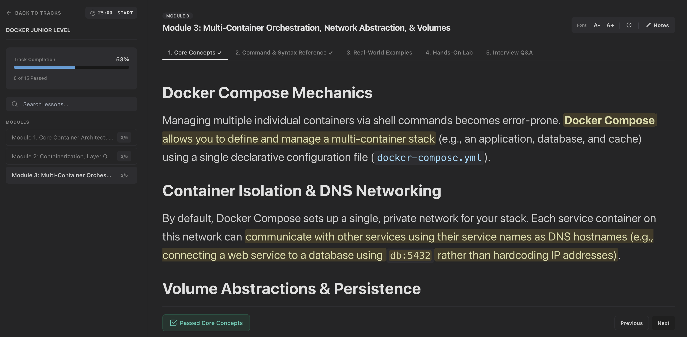

# Self-Paced Learning Portal

A lightweight, self-hosted learning portal for self-paced study in DevOps, SRE, and software development. 

## Courses
- Docker junior, mid, and senior levels, and DCA preparation
- Kubernetes junior, mid, and senior levels and CKA preparation
- LFCS preparation
- Python junior, mid, and senior levels
- ...

## Visuals

### Course Selection Dashboard


### Interactive Workspace


### Dark mode


## How to Run

### Prerequisites
* **Python 3.8+** must be installed on your system.

### 1. Clone the Repository
```bash
git clone git@github.com:s06a/self-paced-learning-portal.git
cd self-paced-learning-portal
chmod +x run.sh
```

### 2. Launch the Application
```bash
bash run.sh
```

### 3. Access the Portal
```text
http://127.0.0.1:8000
```

## Adding Your Own Curricula
To add a new course, create a Python file (e.g., `ansible.py`) inside the `/courses` directory. The platform automatically detects and loads new Python curricula on the next page refresh.

To maintain an educational standard, each module in a custom curriculum is structured into 5 interactive tabs:
1. **Core Concepts (Theory)**: Conceptual overview under major topic-focused headings.
2. **Command & Syntax Reference**: Common CLI commands, programming language syntax, and structural rules with brief descriptions and usage notes.
3. **Real-World Examples**: Multiple practical, scenario-based application examples using **Situation** and **Action** structures.
4. **Hands-On Lab**: Multiple sequential hands-on exercises using **Objective** and **Tasks** structures.
5. **Interview Q&As (Insight)**: Deep-dive question-and-answer pairs, potentially accompanied by specific certification study focus points.

---

### Generating New Course Content
To easily generate curriculum files, we have prepared a comprehensive prompt system and reference template inside the `prompts/` directory:

- **[Course Generator Prompt](prompts/course_generator_prompt.md)**: A modular, complementary LLM system prompt. You can copy the block, append your short instruction (e.g., *"add an ansible playbooks track"*), and execute it to get a complete, valid python configuration file.

Feel free to open a PR!

## Disclaimer
The educational content is generated using LLMs.

## License
This project is licensed under the MIT License.